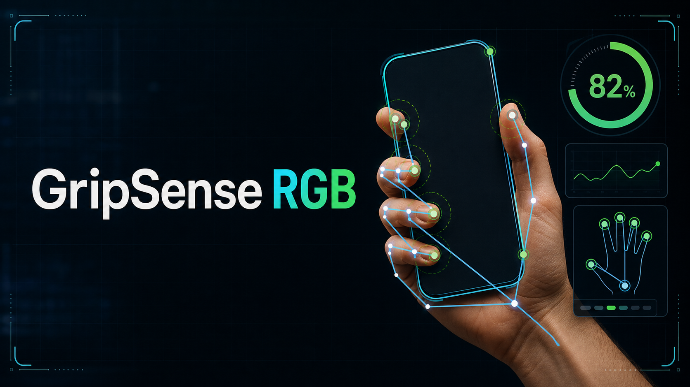

# GripSense RGB



**GripSense RGB** is a browser-based prototype for estimating hand-object grip quality from a live RGB webcam. It tracks hand landmarks, infers a nearby object region, estimates visual grip stability, and marks likely grip points on the object.

Important limitation: this app does not measure physical force. The grip percentage is a computer-vision estimate based on visible geometry and motion. True grip force needs pressure sensors, instrumented objects, a smart glove, or calibrated depth/force hardware.

## License And Attribution

GripSense RGB is open source under **AGPL-3.0-or-later** with additional attribution terms.

If you publish, deploy, demonstrate, redistribute, or modify this project, preserve a reasonable attribution notice with the repository URL:

```text
Based on GripSense RGB: https://github.com/DewanshuHaswani/GripSense-RGB
```

See [LICENSE](LICENSE), [ADDITIONAL-TERMS.md](ADDITIONAL-TERMS.md), [NOTICE](NOTICE), and [CITATION.cff](CITATION.cff).

## How to Run

```bash
npm install
npm run dev
```

Open `http://127.0.0.1:5173/`, allow camera access, place your hand and object in frame, and click the object if automatic locking is uncertain. Drag the locked object on the camera overlay if the center is wrong, and use the grow/shrink buttons if the region is too small or too large.

You can open either algorithm directly:

- `http://127.0.0.1:5173/?version=v1`
- `http://127.0.0.1:5173/?version=v2`

The toolbar also has a `V1` / `V2` switch. Changing versions clears the object lock so the two algorithms can be compared cleanly.

## Object Profile V2 Training

GripSense RGB can create a lightweight local Object Profile V2 from webcam captures or uploaded images. This is the main accuracy upgrade for reducing false positives such as an empty hand being treated as an object.

1. Start the camera.
2. Click **Open training portal** in the object profile panel.
3. Live grip scoring pauses while the portal is open, but the camera feed stays available.
4. Use **Capture frame**, **Capture lock**, or **Upload images** to add object views.
5. Review quality suggestions. Weak images are warned, not blocked.
6. Click **Train profile**. If the object has no name yet, the app asks for one.
7. Optional: choose **Save folder** so profiles and thumbnails are mirrored into a local folder.

The profile is stored in browser `localStorage`, so it persists across browser sessions on the same machine. If the browser supports the File System Access API, GripSense can also write `gripsense-object-profiles.json` and sample thumbnails into a user-chosen local folder. It is not uploaded anywhere and it is not a heavy neural-network training job. The browser stores thumbnails plus compact descriptor data for color, edges, shape, mask quality, foreground/background contrast, and small texture cues. During live tracking, the app compares the current locked object against enabled saved profiles and shows `Object detected: <name>` with a match percentage when the profile matches.

This improves object identity awareness: the grip model can tell whether the current lock resembles the object the user intended to grip, rather than only relying on generic object shape.

Object Profile V2 uses a training quality advisor:

- **Needs more angles**: fewer than three good masked views are available.
- **Mask too loose**: the crop includes too much background/hand or too little object.
- **Good view**: the crop has enough object coverage, edges, contrast, and texture.
- **Ready to train**: at least three good views are available.

These labels are recommendations. Training is allowed with any readable image set, because the whole point of object training is to help when the live tracker is uncertain. More clean angles simply make matching more reliable.

Each profile stores `id`, `name`, `enabled`, captured samples, crop bounds, object-region metadata, descriptor vectors, descriptor variance, minimum training quality, and the recommended view count. New profiles are enabled by default. Disabled profiles remain saved but are ignored during live matching. The descriptor logic is behind an `ObjectDescriptorProvider` interface, so a later backend, ONNX, or embedding model can replace the handcrafted browser descriptor without rewriting the trainer UI or grip scorer.

When at least one trained profile exists, V2 adds an identity gate:

```text
current object accepted =
  object lock is stable
  AND visual grip evidence is plausible
  AND trained-object match is above threshold
```

If the identity match is weak, the app reports `Object uncertain` / `Trained object not found` instead of showing a strong grip. If no profile exists, V2 falls back to its generic object-first logic.

For best results, record both calibration profiles:

- **Strong**: hold the object firmly for about one second.
- **Weak**: hold the object loosely or in a bad pose for about one second.

Useful checks:

```bash
npm run test
npm run build
npm audit --audit-level=moderate
```

## What the App Uses

The app uses MediaPipe Tasks Vision locally in the browser:

- `HandLandmarker` tracks 21 hand landmarks per detected hand.
- `ObjectDetector` provides optional object-box hints when a known object is recognized.
- `InteractiveSegmenter` supports click-to-correct object interaction.
- The MediaPipe WASM runtime and model files are vendored into `public/mediapipe/` so the app does not depend on remote model downloads during normal use.

The hand tracker is based on MediaPipe Hands, which uses a palm detector plus a hand landmark model for real-time RGB hand tracking. The browser API exposes normalized image landmarks and world landmarks, and `detectForVideo()` is the intended video-frame call path.

## Grip Algorithm

The app combines practical real-time tracking with grasp-quality ideas from robotics. It no longer depends only on fingertip distance, because phones and other real objects often hide fingertips or the thumb.

There are two selectable versions:

- **V1**: the original permissive webcam heuristic. It tries hard to infer an object from the hand corridor and is useful for quick demos, but can be overconfident when the background resembles an object.
- **V2**: the stricter object-first model. It requires independent object evidence before grip scoring, separates object confidence from grip quality, and intentionally reports `Hand only` or `Object uncertain` instead of forcing a high grip score.

V2 uses a confidence gate before the grip model runs:

```text
object accepted =
  manual/segmenter lock
  OR detector-backed object
  OR automatic object with texture/edge evidence + tight hand-corridor fit + non-open hand
```

If this gate fails, V2 returns no grip percentage even if the hand pose looks closed. This is the main defense against the “empty hand but confident object” problem.

Each frame is classified into a grip mode:

- `phone-side grip`: phones, remotes, and long rectangular objects held by side edges.
- `pinch grip`: small objects held between thumb and index.
- `power grip`: bottles, mugs, and tools held with the whole hand.
- `hook grip`: curled fingers carry the object with little visible thumb support.
- `open hand`: a hand is visible but not really grasping.
- `uncertain`: insufficient object/hand evidence.

- Finger curl: whether fingers are bending around the object.
- Finger segment contact: whether fingertip, middle, or lower finger segments are near the object boundary.
- Palm-object containment: whether the object sits between the palm and curled fingers.
- Thumb support: thumb opposition when visible, with a fallback when the thumb is partly hidden.
- Phone-side grip: side-edge grip evidence for phone-like, remote-like, and rectangular objects.
- Object lock quality: whether the app trusts the inferred object region.
- Independent object evidence: whether the candidate object has evidence separate from the hand, such as detector support, manual click, strong edges, or texture.
- Temporal lock: how long the same object lock has remained stable across recent frames.
- Persistent slip: whether object and hand motion diverge across several frames, not just one noisy frame.

The final percentage is a weighted visual stability score:

```text
grip = segment contact + finger curl + containment + thumb support + phone-side grip
       + object lock quality + motion coupling - persistent slip
```

The exact weights change by grip mode. Phone-side grips prioritize side-edge support and occlusion resilience. Power grips prioritize palm containment, finger wrap, and segment contact. Pinch grips prioritize thumb-index opposition and small-object stability.

In V2, the score is additionally multiplied by an object-readiness factor and, when profiles exist, object identity match. This means a visually strong hand pose cannot become a high-confidence grip unless the object itself is believable and resembles the trained object.

This is inspired by grasp quality work such as force-closure and contact-point planning, but adapted for webcam RGB input. Full Ferrari-Canny or Dex-Net style grasp quality needs reliable 3D object geometry, contact normals, friction assumptions, and often depth data; this prototype only has monocular webcam pixels, so it uses a visible approximation instead.

## Object Lock Quality

The app separately reports object lock quality because a bad object region can make a strong grip look weak. The object tracker rejects boxes that are too large, too far from the hand, or likely to be background/person regions. It constrains automatic regions to the hand grasp corridor and marks elongated, edge-rich regions as `phone-like`.

If object lock quality is low, the app should say that the lock is uncertain instead of blaming the grip. Clicking the object manually usually improves the lock.

Manual lock controls:

- Click the object to lock it.
- Drag on the camera overlay to move the locked object center.
- Use grow/shrink to resize the object region.
- Reset clears the object lock and tracking history.

## Calibration

The calibration buttons record one-second baselines per grip mode and store them in browser `localStorage`.

- **Strong** stores a strong-hold profile.
- **Weak** stores a weak-hold profile.

The app stores closure, enclosure, finger curl, segment contact, phone-side grip, pinch score, power-grip score, thumb support, and object-lock quality. Later frames are compared against the matching grip-mode profile. Strong matches lift the score; weak matches can reduce confidence and score.

Calibration does not create real force sensing. It only tells the visual model, “this pose is a strong hold for this person, object, camera angle, and lighting.”

## Stabilization And Slip

Live webcam landmarks are noisy, so the app now stabilizes tracking before scoring:

- A One Euro filter smooths hand landmark coordinates.
- The object center, radii, angle, and contour are also filtered.
- Numeric score components are filtered separately.
- Guidance labels use hysteresis so the app does not rapidly flip between `Strong grip`, `Improve grip`, and `Reposition`.
- Slip uses a short motion history, so idle objects do not show meaningful slipping and short one-frame jumps do not dominate the score.
- A confidence-gated state machine separates `No hand`, `Hand only`, `Object uncertain`, `Grip detected`, `Strong hold`, and `Slip risk`.

The One Euro filter is useful here because it reduces jitter during slow movement while preserving responsiveness during faster motion. Lower `minCutoff` reduces jitter but adds lag; higher `beta` reduces lag during quick movement.

## UI Metrics

Each metric in the analysis rail has an eye button:

- Confidence: trust in object lock and tracking quality.
- Contacts: number of likely fingertip-object contacts.
- Closure: hand closing amount normalized by hand size.
- Thumb: thumb opposition against fingers.
- Enclosure: how much the fingers surround the object.
- Coupling: whether object motion follows hand motion.
- Object lock quality: whether the app trusts the object region being scored.
- Mode/state: which grip type and tracking state the app believes it is seeing.
- Grip evidence: the components that raised or lowered the score.
- Object evidence: shape, lock age, and whether the object lock was manually adjusted.
- Object profiles: open the training portal, enable/disable profiles, see whether a trained object is enabled, in frame, or actively involved in a grip.

The analysis rail scrolls independently on desktop, so the `Suggested points` section remains reachable even when the camera viewport is short.

## Key Files

- `src/App.tsx`: camera lifecycle, toolbar, analysis rail, frame loop.
- `src/vision/visionEngine.ts`: MediaPipe model loading and fallback.
- `src/vision/gripAnalysis.ts`: grip scoring and suggested grip point generation.
- `src/vision/gripEvidence.ts`: whole-hand evidence model for curl, segment contact, phone-side grip, lock quality, and slip inputs.
- `src/vision/objectProfile.ts`: Object Profile V2 schema, browser descriptor provider, training quality gate, and profile matching.
- `src/vision/types.ts`: shared grip mode, diagnostics, calibration, and tracking types.
- `src/vision/stabilization.ts`: One Euro filtering and guidance hysteresis.
- `src/vision/objectTracking.ts`: generic object-region inference.
- `src/vision/drawing.ts`: canvas overlay rendering.
- `src/vision/gripAnalysis.test.ts`: scoring behavior tests.
- `src/vision/objectProfile.test.ts`: Object Profile V2 training and matching tests.

## References

- [MediaPipe Hand Landmarker Web documentation](https://ai.google.dev/edge/mediapipe/solutions/vision/hand_landmarker/web_js)
- [MediaPipe Hands: On-device Real-time Hand Tracking](https://arxiv.org/abs/2006.10214)
- [1€ Filter: A Simple Speed-based Low-pass Filter for Noisy Input in Interactive Systems](https://gery.casiez.net/1euro/)
- [Planning Optimal Grasps, Ferrari and Canny](https://users.cs.duke.edu/~tomasi/public/ReadingGroup/Ferrari%20and%20Canny%20ICRA%201992.pdf)
- [Dex-Net 2.0: Deep Learning to Plan Robust Grasps with Synthetic Point Clouds and Analytic Grasp Metrics](https://arxiv.org/abs/1703.09312)
