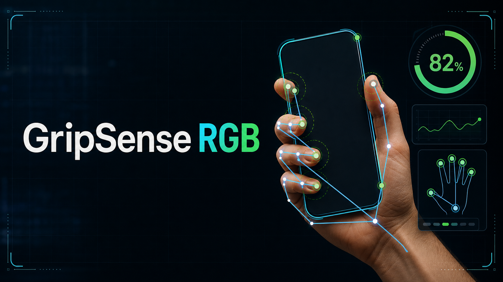

# GripSense RGB



**GripSense RGB** is a browser-based prototype for estimating hand-object grip quality from a live RGB webcam. It tracks hand landmarks, infers a nearby object region, estimates visual grip stability, and marks likely grip points on the object.

Important limitation: this app does not measure physical force. The grip percentage is a computer-vision estimate based on visible geometry and motion. True grip force needs pressure sensors, instrumented objects, a smart glove, or calibrated depth/force hardware.

## License And Attribution

GripSense RGB is open source under **AGPL-3.0-or-later** with additional attribution terms.

If you publish, deploy, demonstrate, redistribute, or modify this project, preserve a reasonable attribution notice with the repository URL:

```text
Based on GripSense RGB: https://github.com/DewanshuHaswani/GripSense-RGB
```

See [LICENSE](LICENSE), [ADDITIONAL-TERMS.md](ADDITIONAL-TERMS.md), [NOTICE](NOTICE), and [CITATION.cff](CITATION.cff).

## How to Run

### Fresh Machine Setup

Use these steps when pulling the GitHub repo onto another computer.

Requirements:

- Node.js 20.19 or newer. Vite 8 requires a recent Node 20+ runtime.
- Python 3.10 or newer for the local inference server.
- A webcam for V1-V8, V10, V11, V12, and V13 live modes.
- Optional: an Intel RealSense D455/D445 camera plus `pyrealsense2` for V9 live, Offline V3 depth, and Offline Max RGB-D evidence.

Clone and install the frontend:

```bash
git clone https://github.com/DewanshuHaswani/GripSense-RGB.git
cd GripSense-RGB
node -v
npm install
```

Run the frontend:

```bash
npm run dev
```

Open `http://127.0.0.1:5173/` in Chrome or another modern browser and allow camera access.

For **V8 live**, **V9 live**, **V11 live**, **V12 live**, **V13 live**, **Offline V2**, **Offline V3**, **Offline Max**, and **Offline YOLO Max**, also start the local Python inference server in a second terminal:

```bash
cd GripSense-RGB/local-inference
python3 -m venv .venv
. .venv/bin/activate
pip install -r requirements.txt
uvicorn server:app --host 127.0.0.1 --port 7867
```

Optional RealSense setup for **V9 · RealSense live**, **Offline V3 · RealSense**, and **Offline Max**:

```bash
cd GripSense-RGB/local-inference
. .venv/bin/activate
pip install pyrealsense2
uvicorn server:app --host 127.0.0.1 --port 7867
```

Keep both terminals open:

- Frontend: `npm run dev`, usually at `http://127.0.0.1:5173/`
- Local inference: `uvicorn server:app --host 127.0.0.1 --port 7867`

Quick health checks:

```bash
curl -I http://127.0.0.1:5173/
curl -I http://127.0.0.1:7867/docs
```

If V8 shows **server unavailable**, it means the browser cannot get a usable RF-DETR response from `http://127.0.0.1:7867/api/rfdetr/analyze`. Check that the Python server is running, dependencies installed correctly, port `7867` is not blocked, and the server terminal did not show an RF-DETR model load error. The first RF-DETR request can be slow because model weights may load or download.

If this happens on a locked-down Windows or office network but `http://127.0.0.1:7867/docs` works, use **V10 · RF-DETR proxy live** at `?version=v10`. V10 runs the same grip analysis as V8, but the browser calls the frontend dev server first and Vite proxies the request to Python. This helps with browser-side localhost, CORS, proxy, and SSL inspection policies. It cannot fix a Python-side model download failure; run the RF-DETR warmup command on a network where Python can download the model or configure the machine's corporate CA certificate for Python.

If V11, V12, or V13 shows **YOLO unavailable**, the frontend could not get a usable response from `POST /api/gripsense/yolo/analyze`, which Vite proxies to `http://127.0.0.1:7867/api/yolo/analyze`. Check that `ultralytics` installed correctly and run `python local-inference/warmup_models.py --model yolo` once so the YOLO segmentation weights download/cache on that machine.

If V9, Offline V3, or Offline Max shows **RealSense unavailable**, RF-DETR can still run, but depth evidence is missing. Check that the RealSense D455/D445 is connected to the same machine, `pyrealsense2` is installed in the local inference virtualenv, and the browser camera view is aligned with the RealSense RGB stream.

Useful verification commands:

```bash
npm run test
npm run build
npm audit --audit-level=moderate
```

### macOS One-Time Setup And Quick Run

Use this on a different Mac after cloning the repo. The setup script expects Homebrew to be installed. It will install or upgrade Node.js and Python through Homebrew when they are missing or too old, then install the app dependencies and warm up the RF-DETR and YOLO models.

```bash
git clone https://github.com/DewanshuHaswani/GripSense-RGB.git
cd GripSense-RGB
chmod +x scripts/setup_mac.sh scripts/start_mac_inference.sh scripts/start_mac_frontend.sh
./scripts/setup_mac.sh
```

If Homebrew is not installed, install it first and then rerun setup:

```bash
/bin/bash -c "$(curl -fsSL https://raw.githubusercontent.com/Homebrew/install/HEAD/install.sh)"
```

For RealSense support on that Mac:

```bash
./scripts/setup_mac.sh --with-realsense
```

If you only want to install dependencies and skip model downloads during setup:

```bash
./scripts/setup_mac.sh --skip-warmup
```

After setup, run these two terminals:

```bash
# Terminal 1
./scripts/start_mac_inference.sh
```

```bash
# Terminal 2
./scripts/start_mac_frontend.sh
```

Open:

- V10 RF-DETR proxy live: `http://127.0.0.1:7676/?version=v10`
- V8 RF-DETR direct live: `http://127.0.0.1:7676/?version=v8`
- V9 RealSense live: `http://127.0.0.1:7676/?version=v9`
- V11 YOLO live: `http://127.0.0.1:7676/?version=v11`
- V12 YOLO production live: `http://127.0.0.1:7676/?version=v12`
- V13 YOLO stable live: `http://127.0.0.1:7676/?version=v13`
- Local server docs: `http://127.0.0.1:7867/docs`

### Windows Setup With RF-DETR And RealSense D455/D445

Use this section for a Windows machine that needs V8/V10 RF-DETR, V11/V12/V13 YOLO, Offline V2, V9 RealSense, Offline V3, Offline Max, or Offline YOLO Max.

Install first:

- Git for Windows.
- Node.js 20.19 or newer.
- Python 3.10 or newer. During install, enable **Add python.exe to PATH**.
- Optional for D455/D445: Intel RealSense SDK 2.0 for Windows, including **Intel RealSense Viewer**.
- Optional for D455/D445: connect the camera directly to a USB 3.x port. Avoid unpowered hubs.

Clone and run the one-time setup from **PowerShell**:

```powershell
git clone https://github.com/DewanshuHaswani/GripSense-RGB.git
cd GripSense-RGB
Set-ExecutionPolicy -Scope Process -ExecutionPolicy Bypass
.\scripts\setup_windows.ps1
```

For RealSense D455/D445 support, run setup with:

```powershell
Set-ExecutionPolicy -Scope Process -ExecutionPolicy Bypass
.\scripts\setup_windows.ps1 -WithRealSense
```

The setup script installs npm packages, creates `local-inference\.venv`, installs Python inference dependencies, and warms up RF-DETR-Seg Nano. YOLO is installed with the same inference dependencies; warm it up separately before first V11/V12/V13/Offline YOLO Max use. Warmup is where model weights are downloaded/cached on that Windows machine and can take several minutes the first time.

Run the app after setup:

```powershell
# Terminal 1
.\scripts\start_windows_frontend.ps1
```

```powershell
# Terminal 2
.\scripts\start_windows_inference.ps1
```

Open:

- V10 RF-DETR proxy live: `http://127.0.0.1:7676/?version=v10`
- V8 RF-DETR direct live: `http://127.0.0.1:7676/?version=v8`
- V9 RealSense live: `http://127.0.0.1:7676/?version=v9`
- V11 YOLO live: `http://127.0.0.1:7676/?version=v11`
- V12 YOLO production live: `http://127.0.0.1:7676/?version=v12`
- V13 YOLO stable live: `http://127.0.0.1:7676/?version=v13`
- Local server docs: `http://127.0.0.1:7867/docs`

RF-DETR model files are intentionally not committed to GitHub. They are large runtime artifacts and may have their own distribution constraints. The supported setup path is to download/cache them on each machine using:

```powershell
.\local-inference\.venv\Scripts\python.exe .\local-inference\warmup_models.py --model rfdetr
```

YOLO model files are also intentionally not committed. Warm/cache the default YOLO segmentation model with:

```powershell
.\local-inference\.venv\Scripts\python.exe .\local-inference\warmup_models.py --model yolo
```

For RealSense D455/D445:

1. Install Intel RealSense SDK 2.0 and open **Intel RealSense Viewer**.
2. Confirm the D455/D445 streams both RGB/color and depth in RealSense Viewer.
3. Close RealSense Viewer before running GripSense so the camera is not locked by another app.
4. Start `.\scripts\start_windows_inference.ps1`.
5. In the browser camera permission prompt, choose the RealSense RGB/color camera if available.
6. Use `?version=v9` for live RealSense mode, Offline V3 inside offline review, or the **Offline Max** upload button for automatic RGB-vs-RGB-D selection.

If V8 shows **server unavailable** on Windows:

- Confirm Terminal 2 is running `uvicorn server:app --host 127.0.0.1 --port 7867`.
- Open `http://127.0.0.1:7867/docs`.
- Run the RF-DETR warmup command above and read any Python error.
- Check Windows Firewall did not block Python on localhost.
- Make sure the frontend is calling `127.0.0.1:7867`, not another machine or port.
- Try V10 at `http://127.0.0.1:7676/?version=v10` if `/docs` works but the browser blocks direct RF-DETR calls. V10 uses the frontend proxy route `/api/gripsense/rfdetr/analyze`.

If V9/Offline V3/Offline Max shows **RealSense unavailable**:

- Confirm the D455/D445 works in RealSense Viewer.
- Confirm `pyrealsense2` is installed inside `local-inference\.venv`.
- Close any other app using the camera.
- Restart the inference server after connecting the D455/D445.
- RealSense depth only helps when the browser RGB image and the D455/D445 depth stream are physically aligned.

```bash
npm install
npm run dev
```

Open `http://127.0.0.1:5173/`, allow camera access, place your hand and object in frame, and click the object if automatic locking is uncertain. Drag the locked object on the camera overlay if the center is wrong, and use the grow/shrink buttons if the region is too small or too large.

You can open either algorithm directly:

- `http://127.0.0.1:5173/?version=v1`
- `http://127.0.0.1:5173/?version=v2`
- `http://127.0.0.1:5173/?version=v3`
- `http://127.0.0.1:5173/?version=v4`
- `http://127.0.0.1:5173/?version=v5`
- `http://127.0.0.1:5173/?version=v6`
- `http://127.0.0.1:5173/?version=v7`
- `http://127.0.0.1:5173/?version=v8`
- `http://127.0.0.1:5173/?version=v9`
- `http://127.0.0.1:5173/?version=v10`
- `http://127.0.0.1:5173/?version=v11`
- `http://127.0.0.1:5173/?version=v12`
- `http://127.0.0.1:5173/?version=v13`

The toolbar also has a `V1` through `V13` switch. Changing versions clears the object lock so the algorithms can be compared cleanly.

### Optional Local Inference CPU Server

V8/V9/V10 live mode and Offline V2/V3/Max enhancement use a local Python server with RF-DETR on CPU by default. V11/V12/V13 live and Offline YOLO Max use the same local server with Ultralytics YOLO segmentation on CPU by default. V9, Offline V3, and Offline Max can also sample Intel RealSense depth when `pyrealsense2` and a connected D455/D445 camera are available. Frames stay on your machine.

```bash
cd local-inference
python3 -m venv .venv
. .venv/bin/activate
pip install -r requirements.txt
# Optional, only for RealSense V9 / Offline V3 / Offline Max depth:
pip install pyrealsense2
uvicorn server:app --host 127.0.0.1 --port 7867
```

Then start the frontend in another terminal:

```bash
npm run dev
```

The frontend calls `POST http://127.0.0.1:7867/api/rfdetr/analyze` by default for V8 RF-DETR. Override with `VITE_GRIPSENSE_RFDETR_ENDPOINT` if needed. V10 calls same-origin `POST /api/gripsense/rfdetr/analyze`; Vite proxies that to `http://127.0.0.1:7867/api/rfdetr/analyze` by default. V11/V12/V13 and Offline YOLO Max call same-origin `POST /api/gripsense/yolo/analyze`; Vite proxies that to `http://127.0.0.1:7867/api/yolo/analyze`. Override the proxy target with `VITE_GRIPSENSE_INFERENCE_TARGET` or override YOLO directly with `VITE_GRIPSENSE_YOLO_ENDPOINT`. RealSense V9, Offline V3, and Offline Max call `POST http://127.0.0.1:7867/api/realsense/depth-signal`; override with `VITE_GRIPSENSE_REALSENSE_ENDPOINT` if needed. The default RF-DETR model is RF-DETR-Seg Nano with `GRIPSENSE_RFDETR_DEVICE=cpu`; the default YOLO model is `yolo11n-seg.pt` with `GRIPSENSE_YOLO_DEVICE=cpu`.

## Offline Video Review

GripSense RGB also supports offline review. Click **Offline video**, **Offline Max**, or **YOLO Max** and the app asks whether you want to **Record live** or **Upload from gallery**. Gallery upload accepts MP4/WebM/MOV files, processes the clip first, then shows the completed review with **Play review** plus CSV, JSON, MP4, MP4 Compact, and WebM download buttons. The toolbar **Record** button has two paths: **15-second offline clip** records plain camera video without live overlays, then asks which offline processor to use; **Record with visuals** asks which live model to run, then records the visible overlay into a WebM. The uploaded or recorded file stays local in the browser unless you are using the local inference server, where frames are sent only to `127.0.0.1`.

Offline mode adds liquid-glass overlays directly on top of the video:

- Left overlay: grip percentage, guidance, tracking state, grip mode, and matched object.
- Right overlay: confidence, object lock, closure, contact, thumb support, and slip risk.
- Timeline overlay: grip percentage over time, object match over time, slip-risk bars, and weak-grip segments.
- Export buttons: download CSV, JSON, MP4, MP4 Compact, or WebM.
- The video remains visible behind the transparent panels, while the text and bars stay readable.

You can use the video controls to pause, scrub, or replay. Scrubbing is useful for inspecting when grip quality changes.

Offline Review has four existing algorithms plus a YOLO Max path:

- **Offline V1**: the original offline review path. It is unchanged and starts quickly.
- **Offline V2**: scans the full clip before review, uses RF-DETR object masks when the local server is available, and then applies future/past smoothing. Its timeline includes grip score, object score, contact evidence, weak segments, and slip events. If RF-DETR is unavailable, Offline V2 keeps using the existing local review path and reports the server status in the overlay.
- **Offline V3 · RealSense**: adds aligned RealSense stereo depth contact on top of Offline V2's RF-DETR mask pipeline. It still scans the full clip before preview/export, then applies future/past smoothing with depth contact, depth separation, stereo confidence, object score, weak segments, and slip events. If RealSense depth is unavailable, Offline V3 reports that state and falls back to RF-DETR/RGB evidence rather than inventing depth confidence.
- **Offline Max**: the best-available offline path for both RGB webcams and RealSense D455/D445. Click **Offline Max**, choose **Upload from gallery** or **Record live**, and the app scans the full clip first. If enough reliable D455/D445 depth frames are present, Max uses the RGB-D path; otherwise it automatically falls back to the RF-DETR RGB path. The preview and exports use the finalized smoothed timeline, not a first-pass preview.
- **Offline YOLO Max**: scans the full clip first like Offline Max, but uses YOLO segmentation masks instead of RF-DETR for RGB object evidence. Click **YOLO Max**, choose **Upload from gallery** or **Record live**, and keep the local inference server running. Browser preview, **Play review**, MP4, and MP4 Compact downloads all reuse the finalized server-generated annotated artifact from the YOLO Max batch processor, so the website result matches the processed-folder result. It still rejects `person`, does not trust class labels for grip scoring, and uses future/past smoothing before preview/export.

On Windows, start `scripts\start_windows_inference.ps1 -Port 7867` first, then `scripts\start_windows_frontend.ps1 -Port 7676 -InferencePort 7867`. The frontend calls same-origin `/api/gripsense/...` endpoints and Vite proxies them to `127.0.0.1:7867`, which avoids most office SSL/proxy interception problems because the browser is not calling an external HTTPS model server.

## Object Profile V2 Training

GripSense RGB can create a lightweight local Object Profile V2 from webcam captures or uploaded images. This is the main accuracy upgrade for reducing false positives such as an empty hand being treated as an object.

1. Start the camera.
2. Click **Open training portal** in the object profile panel.
3. Live grip scoring pauses while the portal is open, but the camera feed stays available.
4. Use **Capture frame**, **Capture lock**, or **Upload images** to add object views.
5. Review quality suggestions. Weak images are warned, not blocked.
6. Click **Train profile**. If the object has no name yet, the app asks for one.
7. Optional: choose **Save folder** so profiles and thumbnails are mirrored into a local folder.

The profile is stored in browser `localStorage`, so it persists across browser sessions on the same machine. If the browser supports the File System Access API, GripSense can also write `gripsense-object-profiles.json` and sample thumbnails into a user-chosen local folder. It is not uploaded anywhere and it is not a heavy neural-network training job. The browser stores thumbnails plus compact descriptor data for color, edges, shape, mask quality, foreground/background contrast, and small texture cues. During live tracking, the app compares the current locked object against enabled saved profiles and shows `Object detected: <name>` with a match percentage when the profile matches.

This improves object identity awareness: the grip model can tell whether the current lock resembles the object the user intended to grip, rather than only relying on generic object shape.

Object Profile V2 uses a training quality advisor:

- **Needs more angles**: fewer than three good masked views are available.
- **Mask too loose**: the crop includes too much background/hand or too little object.
- **Good view**: the crop has enough object coverage, edges, contrast, and texture.
- **Ready to train**: at least three good views are available.

These labels are recommendations. Training is allowed with any readable image set, because the whole point of object training is to help when the live tracker is uncertain. More clean angles simply make matching more reliable.

Each profile stores `id`, `name`, `enabled`, captured samples, crop bounds, object-region metadata, descriptor vectors, descriptor variance, minimum training quality, and the recommended view count. New profiles are enabled by default. Disabled profiles remain saved but are ignored during live matching. The descriptor logic is behind an `ObjectDescriptorProvider` interface, so a later backend, ONNX, or embedding model can replace the handcrafted browser descriptor without rewriting the trainer UI or grip scorer.

## Version 4: Stable Trained Object Workflow

V4 is the preferred trained-object-first flow:

```text
trained object list -> enable target object -> detect target over time -> estimate visual grip
```

V4 adds four upgrades over V3:

- **Stronger browser descriptor**: the local descriptor now combines HSV/color histograms, RGB/chroma cues, edge orientation, spatial layout, radial layout, shape, coverage, contrast, and texture. It is still browser-only, but the descriptor interface remains ready for a future ONNX, CLIP, DINO, or local Python embedding provider.
- **Data augmentation**: each masked training crop generates extra descriptor variants with horizontal flip, brightness, and contrast changes. This improves matching across lighting and camera shifts without uploading data.
- **Guided training coverage**: every training image can be marked as `front`, `side`, `rotated`, `in hand`, `alone`, or `negative`. The portal shows whether the profile is likely weak, good, or robust. Negative examples reduce false positives from empty hands, background, or similar objects.
- **Temporal identity**: V4 waits for repeated matches across recent frames before turning the object green. One noisy frame is not enough.

V4 does not currently ship a neural embedding model. That is intentional for this browser-only build: adding CLIP/DINO-style embeddings requires either bundled ONNX assets or a local/server-side model. The current code keeps the interface ready for that upgrade while improving the local path immediately.

## Version 5: Target Object And Contact-Gated Grip

V5 is the recommended workflow for real testing. It is not only a trained-object list. It has two object sources:

```text
pretrained base object detector -> common object boxes like bottle/cup/phone/laptop
trained object profile matcher -> user-specific identity verification
```

The V5 flow is:

```text
base detector objects + trained profile objects -> select target ID -> verify target over time -> estimate grip only for that target
```

V5 addresses four practical issues:

- **Generic detection before training**: the MediaPipe EfficientDet base detector can show common COCO-style objects before any custom profile exists. In the UI these appear as `B1`, `B2`, and similar base object IDs.
- **Better profile matching from many images**: trained profiles now keep exemplar descriptors from individual training views, not only one averaged descriptor. This helps when 20 images include front, side, rotated, in-hand, and lighting-varied views that would otherwise average into a weak profile.
- **All-frame object scan**: V5 scans base detector objects and enabled trained profiles across the frame, draws IDs on visible candidates, and mirrors the same IDs in the right panel.
- **Explicit target selection**: grip scoring does not automatically jump to whichever object-like area is strongest. Select a base object ID such as `B1 · bottle` or use the `Track` button beside a saved trained profile.
- **Contact gate**: even if the selected target is detected, V5 requires current visual contact between the target and the hand. If the object drops away from the hand, a previous lock cannot keep the grip percentage high.

Training still remains local and browser-only. It is not true neural fine-tuning of the base detector weights. Instead, it builds a local object identity profile on top of the base detector pipeline. The crop/mask review now supports direct dragging: drag the crop rectangle to move it, drag the lower-right handle to resize it, or use the existing sliders for precise adjustment. Weak training images are warned, not blocked.

## Version 6: Offline V2 Tracking For Live Video

V6 keeps V5's contact-gated grip scoring, but replaces the live object acquisition path with the stronger Offline V2 tracking strategy:

```text
live hand landmarks -> hand-near object candidates -> sticky target track -> contact-gated grip score
```

V6 is useful when the generic detector label is unstable or wrong. Instead of trusting a single frame, V6 keeps a stable object track using:

- **Track first, classify second**: V6 follows the object-like region near the hand before caring about the class label.
- **Short miss tolerance**: if the detector misses the object for a few frames because of blur or occlusion, V6 keeps the previous object region alive.
- **Hand-object proximity**: an object inside or close to the hand corridor can stay active even when the generic detector is uncertain.
- **Label ignoring for sticky tracking**: V6 can track a can even if the base detector temporarily calls it `toothbrush`, `remote`, or `person`.
- **Same safety gate as V5**: grip percentage still requires visible contact, so an object that moves away from the hand should not keep a high score.

Use V5 when you want explicit target selection and stricter behavior. Use V6 when you want the live camera to behave more like the improved offline review.

## Version 8: RF-DETR Live Masks

V8 adds local RF-DETR-Seg Nano object evidence to live grip analysis:

```text
webcam frame -> local RF-DETR mask/box -> best non-person hand-near object -> mask-contact grip score
```

V8 does not trust object labels for grip quality. Labels are only diagnostic text. A `person` detection is rejected as a grip object by default. The selected object is scored by hand proximity, RF-DETR mask overlap with the hand corridor, and temporal continuity.

Important V8 behavior:

- A closed hand alone cannot produce a high grip score.
- Strong grip is capped unless the RF-DETR mask overlaps the hand corridor.
- If the object drops away from the hand, object confidence and grip decay quickly.
- If the RF-DETR server is unavailable, V8 shows `RF-DETR unavailable` and does not fake confidence or fall back to a high heuristic score.

Limitations: RF-DETR-Seg Nano on CPU can be slower than the webcam frame rate, especially on large frames. Lighting, blur, occlusion, and unusual objects can still reduce mask quality. The app estimates visual grip stability only; it does not measure real force.

## Version 10: RF-DETR Proxy Live

V10 is an additive Windows-friendly copy of V8. It uses the same RF-DETR mask selection and grip scoring behavior as V8, but changes the browser transport:

```text
browser -> Vite same-origin proxy -> local Python RF-DETR server -> V8 grip analysis
```

Use V10 when V8 reports `RF-DETR unavailable` on a managed Windows or office machine even though the Python server docs page opens at `http://127.0.0.1:7867/docs`. The frontend request goes to `/api/gripsense/rfdetr/analyze`, and `vite.config.ts` proxies it to `/api/rfdetr/analyze` on the local inference server.

V10 does not change grip scoring, object selection, person rejection, smoothing, or RF-DETR confidence rules. It also does not bypass Python-side SSL errors while downloading model weights. If the inference server terminal shows certificate or download failures, fix Python's network/certificate setup or run the warmup on a network where the model can be downloaded.

## Version 11: YOLO Live Masks

V11 is an additive YOLO-backed copy of V8's grip logic:

```text
webcam frame -> local YOLO segmentation mask/box -> best non-person hand-near object -> mask-contact grip score
```

V11 does not trust YOLO class labels for grip quality. Labels are diagnostic only, `person` detections are rejected, and the selected object is scored by hand proximity, mask overlap with the hand corridor, and temporal continuity. If the YOLO endpoint is unavailable, V11 shows `YOLO unavailable` and does not fake confidence.

V11 also applies a live display stabilizer to the grip percentage while YOLO lock/contact evidence remains stable. Small frame-to-frame mask jitter is damped, but real object loss, low confidence, or contact collapse still drops the score quickly.

Limitations: CPU YOLO segmentation is usually easier to install than RF-DETR on many Windows laptops, but it can still miss objects during blur, occlusion, glare, or poor lighting. Warm up the model once with `python local-inference/warmup_models.py --model yolo`.

## Version 12: YOLO Production Grip Gate

V12 is an additive copy of V11's YOLO live pipeline with a stricter production scoring layer:

```text
webcam frame -> local YOLO segmentation -> non-person object near hand -> object-in-hand validation -> label-first grip output
```

V12 still does not trust YOLO class labels for grip quality. It uses mask/box evidence only for object presence and contact. Compared with V11, V12 adds:

- Object-required scoring: an empty hand cannot keep a mild/moderate/strong grip label.
- Object-in-hand validation: thumb/finger corridor contact, visible boundary contact, temporal continuity, and detector object score must agree.
- Partial-grip support: thumb plus one or two fingers can produce a real grip label when YOLO sees the object and contact is visible.
- Short blink smoothing: one or two missed YOLO frames can be bridged with fast decay, but real object loss drops to gray/no grip quickly.
- Motion/edge-on grace: after a stable YOLO lock, V12 can briefly hold a degraded object overlay during fast blur or a thin side-view phone angle while the hand still looks wrapped around the same object. The hold expires quickly, and open-hand or no-hand evidence immediately returns to gray/no grip.
- Label-free output: generic YOLO names such as `bottle`, `brush`, or `remote` are not used as grip labels.

This follows the same direction as hand-object interaction work that emphasizes contact and temporal consistency rather than category names. Useful references: [ContactPose](https://contactpose.cc.gatech.edu/), [HOI4D](https://hoi4d.github.io/), [DexYCB](https://dex-ycb.github.io/), and [HOT3D](https://github.com/facebookresearch/hot3d).

Run it with:

```bash
npm run dev -- --host 127.0.0.1 --port 7676
cd local-inference
. .venv/bin/activate
uvicorn server:app --host 127.0.0.1 --port 7867
```

Then open `http://127.0.0.1:7676/?version=v12`.

## Version 13: YOLO Stable Live

V13 is an additive live-only copy of V12 that keeps the object-required grip gate, then adds a steadier object-in-hand and visualization layer:

```text
webcam frame -> YOLO segmentation -> V12 object-in-hand gate -> V13 occlusion bridge + visual-lock smoothing
```

V13 is meant for the two V12 failure cases seen during testing:

- Hand hides part of the phone/cup: if YOLO briefly loses the object but the thumb/finger geometry still looks wrapped around the same stable target, V13 holds a degraded grip estimate for about one second instead of instantly collapsing to gray.
- Oval jumps after reacquisition: the visible object oval uses a separate smoothed visual lock, so the detector can reacquire without snapping the overlay across the frame.
- Real object drop: no hand, open hand, slip/drop motion, server unavailable, or persistent object loss still returns to gray/no grip quickly.

V13 still does not trust YOLO class labels for grip scoring, still rejects hand-only scoring, and still needs the local YOLO server. It is for live webcam use; Offline YOLO Max remains the strongest offline RGB path.

Then open `http://127.0.0.1:7676/?version=v13`.

## Version 9: RealSense RGB-D Live

V9 is an additive RealSense live mode. It keeps V8's RF-DETR mask/box object evidence, then asks the local RealSense endpoint for stereo depth around the current hand and selected object:

```text
webcam frame -> RF-DETR non-person object mask -> RealSense depth contact/separation -> RGB-D grip score
```

V9 is labelled `V9 · RealSense live` in the version picker. It still ignores object labels for grip quality and rejects `person` as the grip object. RealSense depth is used only for physical contact evidence:

- Depth contact can raise confidence when the object surface and hand corridor are at compatible depth.
- Depth separation caps grip quickly when RGB hand geometry looks closed but the object is away from the hand.
- Stereo confidence and surface continuity help decide whether to trust the depth sample.
- If the RealSense endpoint is unavailable, V9 reports `RealSense unavailable` and keeps depth contact at zero rather than faking confidence.

Limitations: the browser must use the RealSense RGB stream or another camera view aligned closely enough with the RealSense depth stream. Poor alignment, reflective objects, very close objects, blur, and hand occlusion can reduce depth quality. V9 improves visual contact evidence; it still does not measure actual grip force.

## Version 3: Trained Object Focus

V3 is intentionally narrower than the generic tracker. It focuses on the objects you trained and enabled:

- The **Object profiles** panel is the list of objects GripSense currently knows how to detect.
- Each profile has a power button. Enabled profiles are searched live; disabled profiles stay saved but are completely ignored by V3 tracking.
- The **V3 detectable now** list shows the enabled trained objects that currently look visible in the camera frame, with a match percentage.
- When a trained object candidate is strong enough, V3 uses that candidate as the object lock instead of relying on a generic hand-corridor guess.
- If an enabled trained object is not visible, V3 should show an object/identity issue rather than pretending that an empty hand is gripping something.

This makes the app more predictable: train `Phone`, `Remote`, and `Bottle`, then turn on only the thing you want to evaluate. The grip score is then conditioned on that object being present, instead of trying to infer every possible object from the background.

When at least one trained profile exists, V2 adds an identity gate:

```text
current object accepted =
  object lock is stable
  AND visual grip evidence is plausible
  AND trained-object match is above threshold
```

If the identity match is weak, the app reports `Object uncertain` / `Trained object not found` instead of showing a strong grip. If no profile exists, V2 falls back to its generic object-first logic.

For best results, record both calibration profiles:

- **Strong**: hold the object firmly for about one second.
- **Weak**: hold the object loosely or in a bad pose for about one second.

Useful checks:

```bash
npm run test
npm run build
npm audit --audit-level=moderate
```

## What the App Uses

The app uses MediaPipe Tasks Vision locally in the browser:

- `HandLandmarker` tracks 21 hand landmarks per detected hand.
- `ObjectDetector` provides optional object-box hints when a known object is recognized.
- `InteractiveSegmenter` supports click-to-correct object interaction.
- The MediaPipe WASM runtime and model files are vendored into `public/mediapipe/` so the app does not depend on remote model downloads during normal use.

The hand tracker is based on MediaPipe Hands, which uses a palm detector plus a hand landmark model for real-time RGB hand tracking. The browser API exposes normalized image landmarks and world landmarks, and `detectForVideo()` is the intended video-frame call path.

## Grip Algorithm

The app combines practical real-time tracking with grasp-quality ideas from robotics. It no longer depends only on fingertip distance, because phones and other real objects often hide fingertips or the thumb.

There are two selectable versions:

- **V1**: the original permissive webcam heuristic. It tries hard to infer an object from the hand corridor and is useful for quick demos, but can be overconfident when the background resembles an object.
- **V2**: the stricter object-first model. It requires independent object evidence before grip scoring, separates object confidence from grip quality, and intentionally reports `Hand only` or `Object uncertain` instead of forcing a high grip score.

V2 uses a confidence gate before the grip model runs:

```text
object accepted =
  manual/segmenter lock
  OR detector-backed object
  OR automatic object with texture/edge evidence + tight hand-corridor fit + non-open hand
```

If this gate fails, V2 returns no grip percentage even if the hand pose looks closed. This is the main defense against the “empty hand but confident object” problem.

Each frame is classified into a grip mode:

- `phone-side grip`: phones, remotes, and long rectangular objects held by side edges.
- `pinch grip`: small objects held between thumb and index.
- `power grip`: bottles, mugs, and tools held with the whole hand.
- `hook grip`: curled fingers carry the object with little visible thumb support.
- `open hand`: a hand is visible but not really grasping.
- `uncertain`: insufficient object/hand evidence.

- Finger curl: whether fingers are bending around the object.
- Finger segment contact: whether fingertip, middle, or lower finger segments are near the object boundary.
- Palm-object containment: whether the object sits between the palm and curled fingers.
- Thumb support: thumb opposition when visible, with a fallback when the thumb is partly hidden.
- Phone-side grip: side-edge grip evidence for phone-like, remote-like, and rectangular objects.
- Object lock quality: whether the app trusts the inferred object region.
- Independent object evidence: whether the candidate object has evidence separate from the hand, such as detector support, manual click, strong edges, or texture.
- Temporal lock: how long the same object lock has remained stable across recent frames.
- Persistent slip: whether object and hand motion diverge across several frames, not just one noisy frame.

The final percentage is a weighted visual stability score:

```text
grip = segment contact + finger curl + containment + thumb support + phone-side grip
       + object lock quality + motion coupling - persistent slip
```

The exact weights change by grip mode. Phone-side grips prioritize side-edge support and occlusion resilience. Power grips prioritize palm containment, finger wrap, and segment contact. Pinch grips prioritize thumb-index opposition and small-object stability.

In V2, the score is additionally multiplied by an object-readiness factor and, when profiles exist, object identity match. This means a visually strong hand pose cannot become a high-confidence grip unless the object itself is believable and resembles the trained object.

This is inspired by grasp quality work such as force-closure and contact-point planning, but adapted for webcam RGB input. Full Ferrari-Canny or Dex-Net style grasp quality needs reliable 3D object geometry, contact normals, friction assumptions, and often depth data; this prototype only has monocular webcam pixels, so it uses a visible approximation instead.

## Object Lock Quality

The app separately reports object lock quality because a bad object region can make a strong grip look weak. The object tracker rejects boxes that are too large, too far from the hand, or likely to be background/person regions. It constrains automatic regions to the hand grasp corridor and marks elongated, edge-rich regions as `phone-like`.

If object lock quality is low, the app should say that the lock is uncertain instead of blaming the grip. Clicking the object manually usually improves the lock.

Manual lock controls:

- Click the object to lock it.
- Drag on the camera overlay to move the locked object center.
- Use grow/shrink to resize the object region.
- Reset clears the object lock and tracking history.

## Calibration

The calibration buttons record one-second baselines per grip mode and store them in browser `localStorage`.

- **Strong** stores a strong-hold profile.
- **Weak** stores a weak-hold profile.

The app stores closure, enclosure, finger curl, segment contact, phone-side grip, pinch score, power-grip score, thumb support, and object-lock quality. Later frames are compared against the matching grip-mode profile. Strong matches lift the score; weak matches can reduce confidence and score.

Calibration does not create real force sensing. It only tells the visual model, “this pose is a strong hold for this person, object, camera angle, and lighting.”

## Stabilization And Slip

Live webcam landmarks are noisy, so the app now stabilizes tracking before scoring:

- A One Euro filter smooths hand landmark coordinates.
- The object center, radii, angle, and contour are also filtered.
- Numeric score components are filtered separately.
- Guidance labels use hysteresis so the app does not rapidly flip between `Strong grip`, `Improve grip`, and `Reposition`.
- Slip uses a short motion history, so idle objects do not show meaningful slipping and short one-frame jumps do not dominate the score.
- A confidence-gated state machine separates `No hand`, `Hand only`, `Object uncertain`, `Grip detected`, `Strong hold`, and `Slip risk`.

The One Euro filter is useful here because it reduces jitter during slow movement while preserving responsiveness during faster motion. Lower `minCutoff` reduces jitter but adds lag; higher `beta` reduces lag during quick movement.

## UI Metrics

Each metric in the analysis rail has an eye button:

- Confidence: trust in object lock and tracking quality.
- Contacts: number of likely fingertip-object contacts.
- Closure: hand closing amount normalized by hand size.
- Thumb: thumb opposition against fingers.
- Enclosure: how much the fingers surround the object.
- Coupling: whether object motion follows hand motion.
- Object lock quality: whether the app trusts the object region being scored.
- Mode/state: which grip type and tracking state the app believes it is seeing.
- Grip evidence: the components that raised or lowered the score.
- Object evidence: shape, lock age, and whether the object lock was manually adjusted.
- Object profiles: open the training portal, enable/disable profiles, see whether a trained object is enabled, in frame, or actively involved in a grip.
- Offline review: transparent left/right overlays for hand visualization, grip strength, and score parameters over uploaded videos.

The analysis rail scrolls independently on desktop, so the `Suggested points` section remains reachable even when the camera viewport is short.

## shadcn / Tailwind Note

This repository is a Vite + React + TypeScript app with custom CSS, not a Tailwind/shadcn project yet. The requested component files were added under `components/ui/`:

- `components/ui/glass-time-card.tsx`
- `components/ui/demo.tsx`

To use those files as real shadcn/Tailwind components, initialize Tailwind and shadcn first:

```bash
npm install -D tailwindcss postcss autoprefixer
npx tailwindcss init -p
npx shadcn@latest init
```

Then configure the `@/*` alias and include `components/**/*.{ts,tsx}` in TypeScript/Tailwind content paths. The default shadcn component folder is `components/ui`; keeping that path matters because generated shadcn imports and examples expect components to live there.

## Key Files

- `src/App.tsx`: camera lifecycle, toolbar, analysis rail, frame loop.
- `src/vision/visionEngine.ts`: MediaPipe model loading and fallback.
- `src/vision/gripAnalysis.ts`: grip scoring and suggested grip point generation.
- `src/vision/gripEvidence.ts`: whole-hand evidence model for curl, segment contact, phone-side grip, lock quality, and slip inputs.
- `src/vision/objectProfile.ts`: Object Profile V2 schema, browser descriptor provider, training quality gate, and profile matching.
- `src/vision/types.ts`: shared grip mode, diagnostics, calibration, and tracking types.
- `src/vision/stabilization.ts`: One Euro filtering and guidance hysteresis.
- `src/vision/objectTracking.ts`: generic object-region inference.
- `src/vision/drawing.ts`: canvas overlay rendering.
- `src/vision/gripAnalysis.test.ts`: scoring behavior tests.
- `src/vision/objectProfile.test.ts`: Object Profile V2 training and matching tests.

## References

- [MediaPipe Hand Landmarker Web documentation](https://ai.google.dev/edge/mediapipe/solutions/vision/hand_landmarker/web_js)
- [MediaPipe Hands: On-device Real-time Hand Tracking](https://arxiv.org/abs/2006.10214)
- [1€ Filter: A Simple Speed-based Low-pass Filter for Noisy Input in Interactive Systems](https://gery.casiez.net/1euro/)
- [Planning Optimal Grasps, Ferrari and Canny](https://users.cs.duke.edu/~tomasi/public/ReadingGroup/Ferrari%20and%20Canny%20ICRA%201992.pdf)
- [Dex-Net 2.0: Deep Learning to Plan Robust Grasps with Synthetic Point Clouds and Analytic Grasp Metrics](https://arxiv.org/abs/1703.09312)
